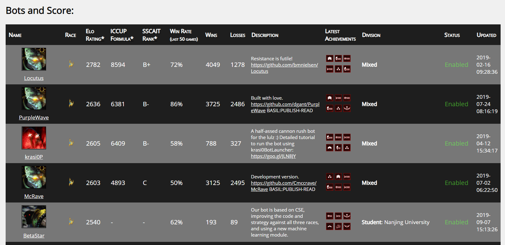

# BetaStar

BetaStar is a StarCraft AI, written by a team at Nanjing University. It is written for StarCraft I. Though It contains some machine learning modules, its main strength comes from heuristic rules and human knowledge.

* It achieves the 9th in the CoG 2019 tournament (formerly CIG).
* It achieves the 5th in the SSCAIT ladder (2019-09-07), shown as below: 

## Facts

BetaStar is based on CSE(AIIDE 2018), improving the codes and strategies against all three races, and using a new machine learning module.

## Strategies

* It exploits Carriers and Shuttles against the mechanized force of Terran.
* It utilizes High Templars against the biochemistry force of Terran.
* It improves Dark Templars against Protoss.
* It perfects Dragoons and Zealots against Zerg.

## Architectures

* It uses Eigen as a computing library and MiniDNN as a machine learning library.
* It provides all training codes(in C++) and data processing code(in Python).

## Starcraft/BWAPI-related 3rd-party Libraries Used

* BWEM
* BWEB

## Team members

Ruo-Ze Liu, Yuntao Ma, Haifeng Guo, Yuzhou Wu, Yuanhao Zheng, Zitai Xiao, Yang Yu, Tong Lu. 